<!-- PROJECT LOGO -->
 

  <h1 align="center">Natchaphon Sirisangsawang's Roblox Internship Portfolio</h1>

  

   Information about my internship Project on the Roblox Learning Environment in Summer Year3 
      

  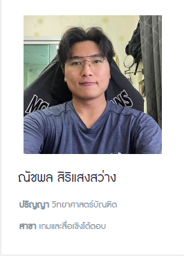

<a href="http://mit.itu.bu.ac.th/th/people/master-phd-students/item/107-%3Cthai%3E-%E0%B8%93%E0%B8%B1%E0%B8%8A%E0%B8%9E%E0%B8%A5-%E0%B8%AA%E0%B8%B4%E0%B8%A3%E0%B8%B4%E0%B9%81%E0%B8%AA%E0%B8%87%E0%B8%AA%E0%B8%A7%E0%B9%88%E0%B8%B2%E0%B8%87-%7B-thai%7D%3Ceng%3E-natchaphon-sirisangsawang-%7B-eng%7D">
    🌐 My Personal Information on BUMIT Website</a> 🌐
     
     
  

## PERSONAL INFORMATION
  - Name | Natchaphon Sirisangsawang
  - NickName | Pruek (พฤกษ์)
  - BirthDate | July 6, 2000
  - Nationality | Thai

## TABLE OF CONTENT

- [**The Challenge** (โจทย์ที่ได้รับ) 👨‍💻](#the-challenge-)
- [**My Work** (งานที่ทำ) 🎮](#my-work-)
- [**Other Activity During IFIT** (กิจกรรม/งานอื่น ระหว่าง IFIT) 🎓](#other-activity-during-ifit-)
- [**Skills** (skill ที่ได้พัฒนา) 📖](#skills-)

## THE CHALLENGE 👨‍💻

- ### Main Challenge Received
<pre>
สร้างสื่อการเรียนรู้สำหรับเด็ก โดยใช้ Platform Roblox เป็นสื่อการเรียนการสอน 
เพื่อให้เด็กๆเข้าใจในหลักของการพัฒนาสื่อเชิงโต้ตอบ หรือการสร้างเกมเบื้องต้น
เเละสามารถนำความรู้ เเละความสนุกที่ได้รับ ไปต่อยอดในอนาคต
</pre>

- ### Personal Challenge Received
<pre>
Challenge : Logical Thinking Zone

สร้างเกมเเนวสื่อการเรียนรู้เกี่ยวกับ เรื่อง: Logical Thinking (การคิดอย่างมีตรรกะ) เพื่อให้น้องๆ
ได้เรียนรู้เกี่ยวกับการคิดเเบบมีตรรกะเพื่อนำไปต่อยอดกับการเขียนโปรเเกรมในการสร้างเกม หรือ Inovation อื่นๆ ในอนาคต
โดยใช้สื่อการสอนแบบ Block of Code ที่จะไม่ได้ให้เด็กมาลงมือเขียน Code จริงๆเเต่จะใช้เป็นการสื่อสารด้วยภาพเเละการเคลื่อนไหว
ของ ตัวละครในเกมที่เด็กสามารถเข้าใจได้ง่ายกว่าตัวอักษร
</pre>

<pre>
Challenge : Coding Zone

สร้างเกมเเนวสื่อการเรียนรู้เกี่ยวกับ เรื่อง: Coding (การเขียนโค้ด) โดยจะสอน Lua ภาษาที่ใช้ในการพัฒนาเกม Roblox เป็นหลัก
โดยจำลอง การเขียน Code เหมือนกับของจริงบน Roblox studio ให้ได้มากที่สุด เเต่จะเพิ่มการเเสดงผล (Output) 
ให้เห็นภาพได้มากกว่าตัวอักษร เเละใน Zone จะสามารถเล่นได้มากกว่า 1 คน (MultiPlayer) เพื่อให้เด็กๆสามารถสนุกกับการเรียนรู้ code ไปพร้อมๆกับเพื่อนๆ
ในเกม Roblox ได้
</pre>

## MY WORK 🎮
#### This is my job learning Lua and started developing with Roblox Studio in the 5 months.

### Coding Zone 

<table>

[//]: # (Line1)
  <tr>
    <td align="center">
        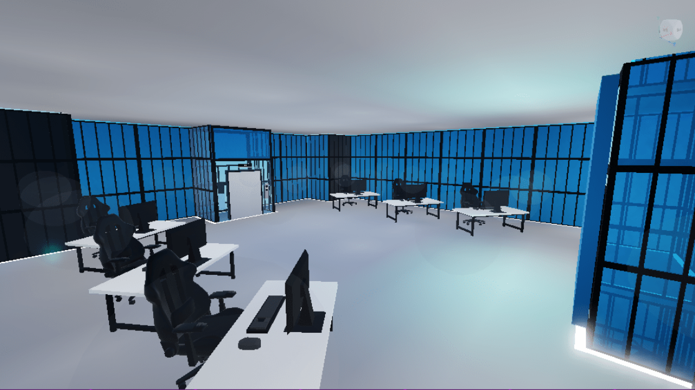
         
        <b>Design infastructure of building</b>
       
    </td>
    <td align="center">
        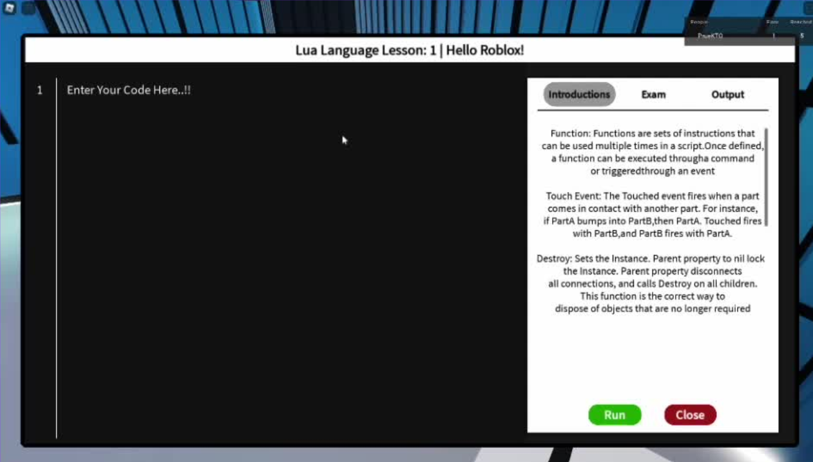
         
        <b>Design UI for console</b>
       
    </td>
  </tr>

[//]: # (Line2)
<tr>
    <td align="center">
        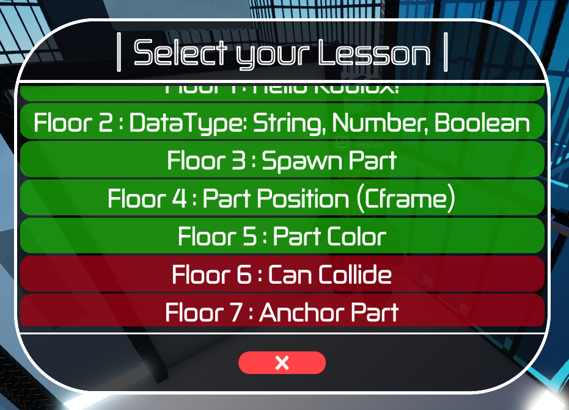
         
        <b>Design Elevator UI</b>
       
    </td>
    <td align="center">
        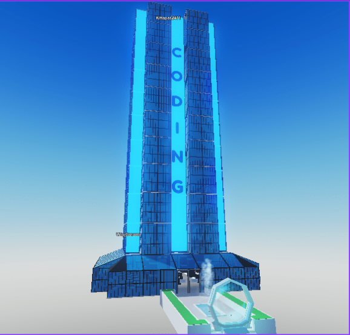
         
        <b>Decorate the Coding tower</b>
       
    </td>
  </tr>

[//]: # (Line3)
  <tr>
    <td align="center">
        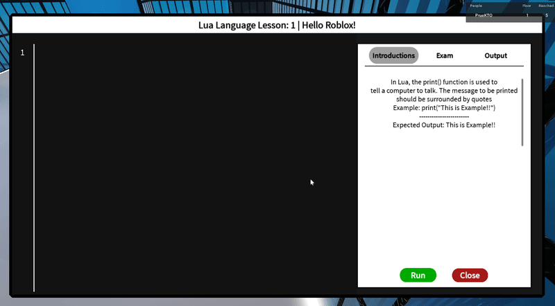
         
        <b>Console system</b>
       
    </td>
    <td align="">
<pre>

###  Console system 
- Lesson Reference
  - Get & setup dialog logic
- Code checker
  - Single-line
  - Multi-line
- Get error line
  - Show hint system
- Exam tracking logic
  - Relate with leaderboard system
  - Clear & reset console when exam changed
  - Change Lesson & information Text when exam changed
- Text box controller
  - Instance & destroy line logic
  - Track current line
  - Limiter char each line
  - Arrow key to control
  - Line switching with backspace & enter
- Open Console UI
  - Disable player controller while Typing
</pre>
  </tr>

[//]: # (Line4)
 <tr>
    <td align="center">
        
         
        <b>Floor & Elevator system</b>
       
    </td>
    <td align="">
<pre>

###  Floor & Elevator system 
- Multi floor teleport logic
  - Relate with each player exam data
  - Lock and unlock the floor
  - Instance Ui Elevator button logic
  - Update UI when pass the exam
  - UI transition
- Auto door logic
  - Sever detector player

</pre>
  </tr>

[//]: # (Line5)
 <tr>
    <td align="center">
        
         
        <b>Instance part system</b>
       
    </td>
    <td align="">
<pre>

###  Instance part system 
  - Client instantiates relate with exam data
  - Camera capture result
  - Clear instance part when changing the floor
  - Reset instance position
  - Each player can instance only one part
</pre>
  </tr>

[//]: # (Line6)
 <tr>
    <td align="center">
        
         
        <b>Leaderboard system</b>
       
    </td>
    <td align="">
<pre>

###  Leaderboard system 
- Relate with each player exam data
- Show the exam(floor) that each player is on.
- Show the exam(floor) that each player can reach
- Reset the exam when player reconnect or dead

</pre>
  </tr>

</table>

### Logical Zone

<table>

[//]: # (Line1)
 <tr>
    <td align="center">
        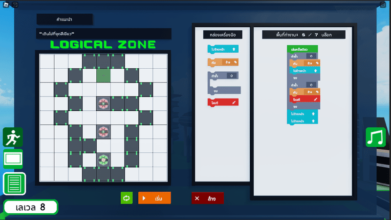
         
        <b>Block of code system</b>
       
    </td>
    <td align="">
<pre>

###  Block of code system 
- Block of code Sorting logic
  - instance & destroy block
  - Auto sorting block system by pos
  - Compute all block value in the board
- Swap block logic
  - Find index of swapping block
  - Instance new sorted block instead of old block
  - Setup repeat block for before swapped
- Repeat Block
  - Insert & remove block in repeat block
  - Compute block value in repeat block
  - Loop amount control
  
</pre>
  </tr>

[//]: # (Line2)
 <tr>
    <td align="center">
        
         
        <b>Camera Mode</b>
       
    </td>
    <td align="">
<pre>

###  Camera Mode 
- Camera Changer
  - Disable player controller when on the board cam
  - Block Raycast limit
  - POV and Bird eyes view mode
- Minimap
  - Generate Minimap according to the stage
  - Update following the real dummy
  - Update when destory objects or zombies
  
</pre>
  </tr>

[//]: # (Line3)
 <tr>
    <td align="center">
        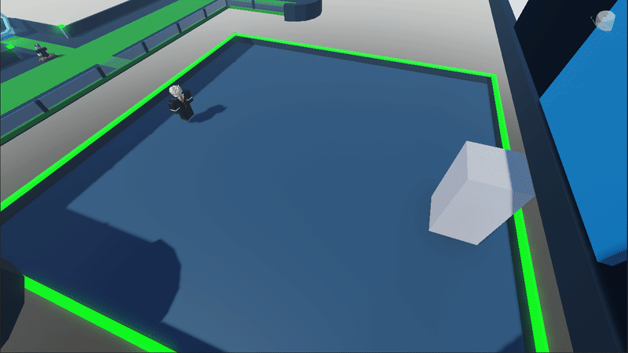
         
        <b>Grid system</b>
       
    </td>
    <td align="">
<pre>

###  Grid system 
- Grid Generator
  - Instance grid logic
  - Sorting and separate each grid to row and column
  - Grid surface GUI

</pre>
  </tr>

[//]: # (Line4)
 <tr>
    <td align="center">
        
         
        <b>Block Command</b>
       
    </td>
    <td align="">
<pre>

###  Block Command 
- Move Command
  - Use raycast to find next & current Grid that dummy stand on
  - Move Forward
  - Turn Left & Right

</pre>
  </tr>

</table>

## Other Activity During IFIT 🎮
<table>
 <tr>
    <td align="center">
        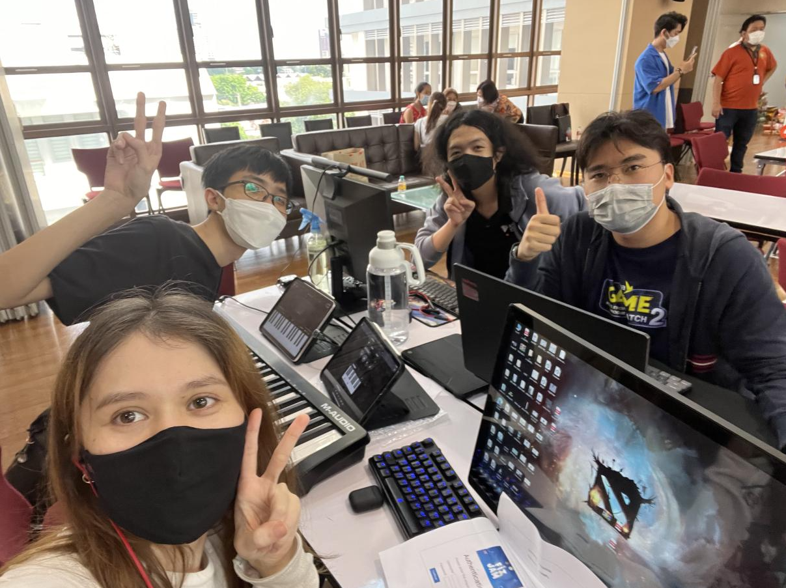
         
        <b>Joined the FIT Game Jam 2022 by The Fine Arts Department, Ministry of Culture</b>
        
 
    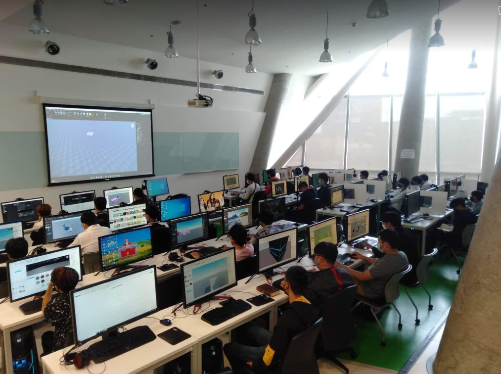
         
        <b>Roblox Workshop Class - Tech the kid about basic Lua Programming</b>
       
  
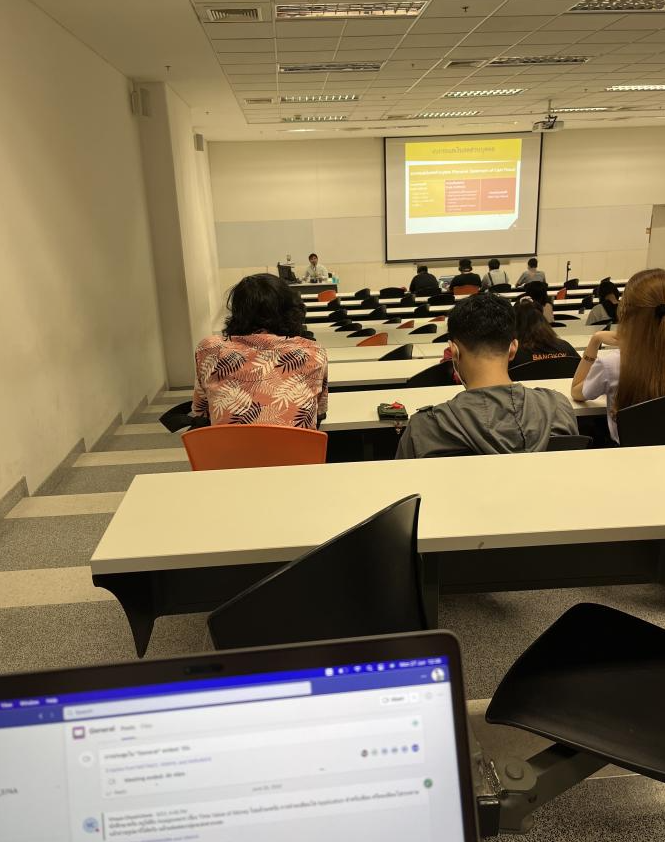
         
        <b>Studied EC200 & FIP141</b>
        
</table>

## Skills 📖

### Improvement Skills 
<pre>
 { | } = 1 Improve Point : Max = { ||||| }  
</pre>
- ### { ||||| } Lua Language 
- ### { ||||| } Roblox Studio 
- ### { |||| } Creativity
- ### { || } Management
- ### { ||| } Collaboration
- ### { ||| } Adaptability 
- ### { | } HTML Language 
- ### { || } English Language 

